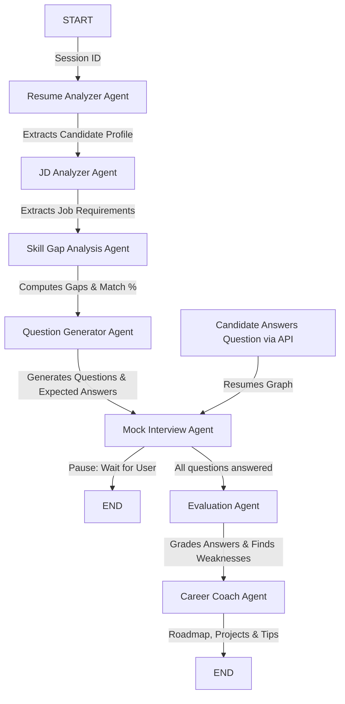

# AI Multi-Agent Interview Preparation Platform

A production-grade, multi-agent AI platform built using Clean Architecture principles to help candidates prepare for job interviews. Powered by **FastAPI**, **LangGraph**, **LangChain**, **Google Gemini API**, and **ChromaDB**.

The platform parses a candidate's resume and job description (JD) using RAG (Retrieval-Augmented Generation), builds a comprehensive gap analysis, generates tailored interview questions of varying difficulty levels, simulates an interactive mock interview session, evaluates candidate transcripts, and offers learning roadmaps.

---

## 🏗️ Architecture Overview

The system follows **Clean Architecture (Domain-Driven Design)** principles, isolating core business logic from outer infrastructure frameworks:

```
                  +-------------------------------------------------------+
                  |                  Presentation Layer                   |
                  |                FastAPI Routes & Middlewares           |
                  +---------------------------+---------------------------+
                                              |
                                              v
                  +-------------------------------------------------------+
                  |                  Application Layer                    |
                  |           Services, Orchestrator, Prompts             |
                  +---------------------------+---------------------------+
                                              |
                                              v
                  +-------------------------------------------------------+
                  |                    Domain Layer                       |
                  |              Entities, Interfaces, Schemas            |
                  +---------------------------+---------------------------+
                                              |
                                              v
                  +---------------------------+---------------------------+
                  |                 Infrastructure Layer                  |
                  |    LLM Clients, Vector Stores, Parsers, SQLite Repository|
                  +-------------------------------------------------------+
```

### 🤖 Core AI Agents & LangGraph State Workflow

The platform implements a true stateful multi-agent workflow using **LangGraph**. The workflow progresses sequentially, checking checkpoints and utilizing SQLite persistence to handle interactive mock interviews:



1. **Resume Analyzer Agent**: Parses PDF resumes, extracting skills, experiences, projects, and education into a structured profile.
2. **Job Description Analyzer Agent**: Analyzes Job Descriptions, extracting required skills, responsibilities, credentials, and keywords.
3. **Skill Gap Analysis Agent**: Evaluates the candidate profile against job requirements to calculate match percentage, missing/matching skills, and suggestions.
4. **Interview Question Generator Agent**: Generates technical, behavioral, project-based, and role-specific questions spanning Beginner, Intermediate, and Advanced difficulties.
5. **Mock Interview Agent**: Runs the interactive loop, acknowledging transcripts, managing state checkpoints, and presenting questions.
6. **Evaluation Agent**: Grades each response out of 10, cross-referencing expectation metrics, and providing structured correct answer key mockups.
7. **Career Coach Agent**: Designs a structured learning roadmap, recommends projects targeting missing skills, and recommends certifications.

---

## 📂 Project Structure

```
project_root/
├── app/
│   ├── api/                  # Presentation Layer: Router endpoints, Middlewares, DI Config
│   │   ├── routes/           # Resume, Job, Interview session, & Health check routes
│   │   ├── dependencies/     # Dependency injection configurations
│   │   └── middleware/       # Structured request/response logging middleware
│   ├── core/                 # Shared Config: exception mapping, logging setup, settings
│   ├── domain/               # Domain Layer: Entities, Pydantic schemas, & Abstract Interfaces
│   ├── application/          # Application Layer: Services, Prompts, & Graph Orchestrator
│   ├── infrastructure/       # Infrastructure Layer: PDF Parsers, Gemini LLM, SQLite, ChromaDB
│   ├── agents/               # Multi-agent implementations (Resume, JD, Gap, etc.)
│   └── graph/                # LangGraph definition: state schemas, nodes, and workflow compilation
├── tests/                    # Comprehensive unit and integration test suites
├── Dockerfile                # Production multi-stage Docker build
├── docker-compose.yml        # Docker compose orchestrating setup
├── requirements.txt          # Python package dependencies
├── .env.example              # Sample environment template
└── README.md                 # System overview and instruction manual
```

---

## ⚡ Setup & Installation

### Local Development Setup

1. **Clone and enter the directory**:
   ```bash
   cd "AI Multi-Agent Interview Preparation System"
   ```

2. **Create and activate a virtual environment**:
   ```bash
   python -m venv venv
   # On Windows:
   .\venv\Scripts\activate
   # On macOS/Linux:
   source venv/bin/activate
   ```

3. **Install dependencies**:
   ```bash
   pip install -r requirements.txt
   ```

4. **Setup Environment Variables**:
   Create a `.env` file in the root directory based on the `.env.example`:
   ```env
   GEMINI_API_KEY=your_actual_gemini_api_key
   DATABASE_URL=sqlite:///./interview_platform.db
   CHROMA_DB_PATH=./chroma_db
   LOG_LEVEL=INFO
   ```

5. **Start the FastAPI application**:
   ```bash
   uvicorn app.main:app --reload
   ```
   The interactive API documentation (Swagger UI) will be available at `http://127.0.0.1:8000/docs`.

---

## 🐳 Docker Deployment

1. **Verify your `.env` contains your Gemini API key**.
2. **Build and spin up the container**:
   ```bash
   docker-compose up --build -d
   ```
3. The server will run on port `8000`. You can query the endpoints or navigate to `http://localhost:8000/docs`.

---

## 🧪 Running Tests

To run the automated tests (verifying agents, routers, schema validations, and mock flows):

```bash
python -m pytest
```

---

## 🚀 API Endpoint Guide & Usage Workflow

Here is the exact progression of API calls to run a complete candidate preparation cycle:

### Phase 1: Upload Materials & Prep Questions

1. **Upload Resume (PDF)**:
   ```bash
   curl -X POST "http://127.0.0.1:8000/resume/upload" \
     -F "file=@/path/to/resume.pdf"
   ```
   *Response includes a generated `session_id`. Use this ID for all subsequent calls.*

2. **Upload Job Description**:
   ```bash
   curl -X POST "http://127.0.0.1:8000/job/upload" \
     -F "session_id=your-session-id" \
     -F "jd_text=Looking for a Backend Python Engineer with FastAPI experience..."
   ```

3. **Trigger Workflow Analysis**:
   Runs the LangGraph up to generating questions, performing Resume parsing, JD parsing, Skill Gap analysis, and Interview Question generation.
   ```bash
   curl -X POST "http://127.0.0.1:8000/analyze" \
     -H "Content-Type: application/json" \
     -d '{"session_id": "your-session-id"}'
   ```

---

### Phase 2: Conduct Interactive Mock Interview

1. **Start/Get First Question**:
   Retrieves the conversational prompt and the question metadata.
   ```bash
   curl -X POST "http://127.0.0.1:8000/mock-interview/start" \
     -H "Content-Type: application/json" \
     -d '{"session_id": "your-session-id"}'
   ```
   *Response includes `question.id` and `interviewer_prompt`.*

2. **Submit Answer & Get Next Question**:
   Loop through this request for all generated questions (index increments automatically).
   ```bash
   curl -X POST "http://127.0.0.1:8000/mock-interview/answer" \
     -H "Content-Type: application/json" \
     -d '{
       "session_id": "your-session-id",
       "question_id": "q1",
       "answer_text": "I handle dependency injection using FastAPI Depends..."
     }'
   ```
   *Repeat until `is_complete` returns `true`.*

---

### Phase 3: Evaluate & View Career Advice

1. **Evaluate Mock Session**:
   Triggers the evaluation and career coaching nodes in the LangGraph workflow.
   ```bash
   curl -X POST "http://127.0.0.1:8000/evaluate" \
     -H "Content-Type: application/json" \
     -d '{"session_id": "your-session-id"}'
   ```

2. **Fetch Complete Report**:
   Retrieves the candidate profile, job requirements, gap analysis report, interview transcripts with question-by-question scoring, overall score, strengths/weaknesses, and custom career coach roadmap/projects.
   ```bash
   curl -G "http://127.0.0.1:8000/report" --data-urlencode "session_id=your-session-id"
   ```

---

## � Tech Stack

| Component | Technology | Version |
|-----------|-----------|---------|
| **Backend Framework** | FastAPI | ≥0.100.0 |
| **ASGI Server** | Uvicorn | ≥0.22.0 |
| **Multi-Agent Orchestration** | LangGraph | ≥0.0.10 |
| **LLM Framework** | LangChain | ≥0.1.0 |
| **AI Model** | Google Gemini API | Latest |
| **Vector Database** | ChromaDB | ≥0.4.0 |
| **Document Parsing** | PyMuPDF, pdfplumber | Latest |
| **Data Validation** | Pydantic | ≥2.0.0 |
| **Database** | SQLite3 | Built-in |
| **Testing** | pytest, pytest-asyncio | ≥7.3.0 |
| **Containerization** | Docker & Docker Compose | Latest |
| **Embedding Model** | Sentence Transformers | ≥3.0.0 |

---

## 📋 Prerequisites

Before setting up the project, ensure you have the following installed:

1. **Python 3.10+**: [Download](https://www.python.org/downloads/)
2. **pip**: Comes with Python
3. **Docker & Docker Compose** (for containerized deployment): [Download](https://www.docker.com/products/docker-desktop/)
4. **Git**: [Download](https://git-scm.com/)
5. **Google Gemini API Key**: [Get API Key](https://ai.google.dev/tutorials/python_quickstart)

### Verify Installation
```bash
python --version        # Should be Python 3.10 or higher
pip --version          # Should be 23+
docker --version       # Should be 24+
git --version          # Should be 2.30+
```

---

## 🔑 Getting Your Gemini API Key

1. Go to [Google AI Studio](https://ai.google.dev/)
2. Click **"Get API Key"** in the top menu
3. Select a project or create a new one
4. Click **"Create API Key"**
5. Copy the generated API key
6. Add it to your `.env` file:
   ```env
   GEMINI_API_KEY=your_copied_api_key_here
   ```

⚠️ **SECURITY**: Never commit your API key to version control. Always use `.env` files and include them in `.gitignore`.

---

## ⚙️ Configuration Details

### Environment Variables

| Variable | Description | Default | Required |
|----------|-------------|---------|----------|
| `GEMINI_API_KEY` | Google Gemini API key | - | ✅ YES |
| `DATABASE_URL` | SQLite database connection string | `sqlite:///./interview_platform.db` | ❌ NO |
| `CHROMA_DB_PATH` | Vector store directory path | `./chroma_db` | ❌ NO |
| `LOG_LEVEL` | Application log level (DEBUG, INFO, WARNING, ERROR) | `INFO` | ❌ NO |
| `HOST` | API server host address | `0.0.0.0` | ❌ NO |
| `PORT` | API server port | `8000` | ❌ NO |

---

## 📊 API Response Examples

### Upload Resume - Success Response
```json
{
  "session_id": "550e8400-e29b-41d4-a716-446655440000",
  "message": "Resume uploaded successfully",
  "filename": "john_doe_resume.pdf"
}
```

### Gap Analysis - Success Response
```json
{
  "session_id": "550e8400-e29b-41d4-a716-446655440000",
  "match_percentage": 72.5,
  "matching_skills": ["Python", "FastAPI", "SQL"],
  "missing_skills": ["Kubernetes", "AWS"],
  "gap_analysis": "Strong backend fundamentals but lacking cloud platform experience"
}
```

### Interview Question - Success Response
```json
{
  "question_id": "q1",
  "difficulty": "Intermediate",
  "category": "Technical",
  "question_text": "How do you implement database transactions in FastAPI?",
  "expected_answer": "Use SQLAlchemy sessions with proper error handling..."
}
```

---

## 🛠️ Troubleshooting

### Issue: `ModuleNotFoundError: No module named 'app'`
**Solution**:
```bash
# Ensure you're running from the project root directory
cd "AI Multi-Agent Interview Preparation System"
# Reinstall dependencies
pip install -r requirements.txt
```

### Issue: `GEMINI_API_KEY not found`
**Solution**:
1. Verify `.env` file exists in the project root
2. Check the API key is correct: `echo $GEMINI_API_KEY`
3. For Windows PowerShell: Use `$env:GEMINI_API_KEY` instead

### Issue: `Port 8000 already in use`
**Solution**:
```bash
# Change port in .env file
PORT=8001
# Or kill the process using port 8000 (Windows):
netstat -ano | findstr :8000
taskkill /PID <PID> /F
```

### Issue: Docker build fails with `requirements.txt not found`
**Solution**:
```bash
# Ensure you're running docker-compose from the project root
docker-compose down
docker-compose build --no-cache
docker-compose up
```

### Issue: ChromaDB connection errors
**Solution**:
```bash
# Remove the corrupted chroma_db and recreate
rm -rf chroma_db
# Restart the application to regenerate ChromaDB
```

---

## 🤝 Contributing

We welcome contributions! Please follow these guidelines:

1. **Fork** the repository
2. **Create** a feature branch (`git checkout -b feature/amazing-feature`)
3. **Commit** changes (`git commit -m 'Add amazing feature'`)
4. **Push** to the branch (`git push origin feature/amazing-feature`)
5. **Open** a Pull Request

### Code Standards
- Follow PEP 8 style guide
- Write tests for new features
- Update documentation
- Use type hints in functions

---

## 📝 License

This project is licensed under the MIT License - see the [LICENSE](LICENSE) file for details.

---

## 📞 Support

For issues, questions, or suggestions:
- Open an [Issue](../../issues)
- Check existing [Discussions](../../discussions)
- Review [Documentation](./docs) (if available)

---

## 🎯 Roadmap

### v1.1 (Q3 2026)
- [ ] Support for multiple LLM providers (Claude, GPT-4)
- [ ] Performance optimization for large PDFs
- [ ] Enhanced error handling and retry logic

### v1.2 (Q4 2026)
- [ ] Real-time Audio Streams: Speech-to-text (STT) support
- [ ] Video Emotion Analytics: Facial analysis during answers
- [ ] Gemini Live Integration: WebSocket support for seamless conversation

### v2.0 (2026)
- [ ] Automatic Resume Optimization
- [ ] Multi-language support
- [ ] Advanced analytics dashboard

---

## 🔮 Future Enhancements

- **Real-time Audio Streams**: Support speech-to-text (STT) for candidates to answer questions verbally.
- **Video Emotion Analytics**: Integrate facial/emotional analysis during answers to gauge confidence levels.
- **Gemini Live Integration**: Shift from turn-based REST APIs to WebSockets, creating a seamless real-time conversation.
- **Automatic Resume Optimization**: Generate a revised PDF version of the candidate's resume tailormade for the job description to instantly bridge gaps.

---

## 👨‍💻 Author

Priyanshu Kumar,
Built with ❤️ by the AI Interview Preparation Team

---

**Last Updated**: June 2026  
**Status**: Production Ready  
**Python Version**: 3.10+  
**License**: MIT
